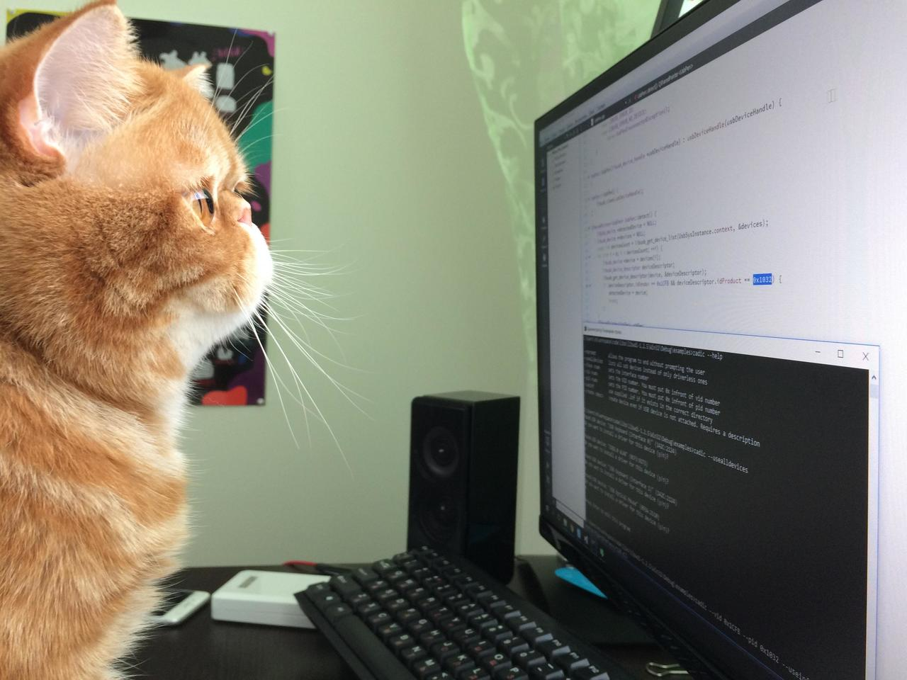

<!-- INFO -->
- title: "Đề Thi Kỹ Thuật Lập Trình 2025 - Cuối Kì"
- author: "Tên tác giả"
- date: "Ngày xuất bản"
- summary: "Tóm tắt nội dung chính của chương này"
- keywords: ["từ khóa 1", "từ khóa 2", "từ khóa 3"]

<!-- CONTENT -->
# Đề Thi Kỹ Thuật Lập Trình - Cuối Kì

**Thời gian:** 90 phút  
**Lớp:** ___________  
**Mã sinh viên:** ___________  
**Họ tên:** ___________

---

## PHẦN I: LÝ THUYẾT (4 điểm)

### Câu 1 (1 điểm)
Giải thích khái niệm và sự khác biệt giữa:
- Biến cục bộ và biến toàn cục
- Truyền tham số theo giá trị và theo tham chiếu

### Câu 2 (1 điểm)
Mảng một chiều là gì? Cho ví dụ cách khai báo và sử dụng mảng trong C/C++.

### Câu 3 (1 điểm)
Giải thích vòng lặp `for`, `while`, `do-while`. Khi nào sử dụng từng loại?

### Câu 4 (0.5 điểm)
Hàm là gì? Liệt kê các thành phần của một hàm (khai báo, định nghĩa, gọi hàm).

### Câu 5 (0.5 điểm)
Xem ảnh sau và giải thích ý nghĩa của biểu đồ:

<!-- Chèn ảnh -->


---

## PHẦN II: VIẾT CODE (6 điểm)

### Bài 1 (2 điểm)
Viết chương trình nhập n số nguyên vào mảng, rồi tính tổng và tìm số lớn nhất.

**Hướng dẫn:** Sử dụng vòng lặp và hàm.

```
__________________________________________________________
__________________________________________________________
__________________________________________________________
__________________________________________________________
```

### Bài 2 (2 điểm)
Viết hàm kiểm tra một số nghuyên có phải số nguyên tố hay không.

```
__________________________________________________________
__________________________________________________________
__________________________________________________________
__________________________________________________________
```

### Bài 3 (2 điểm)
Viết chương trình sắp xếp mảng theo thứ tự tăng dần (Bubble Sort).

```
__________________________________________________________
__________________________________________________________
__________________________________________________________
__________________________________________________________
```

---

**Ghi chú:** Sinh viên phải trình bày rõ ràng, viết đẹp và logic chính xác.
